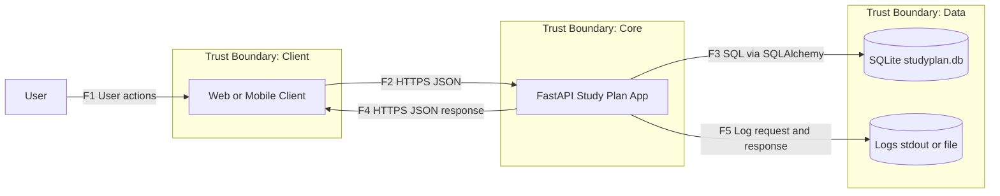
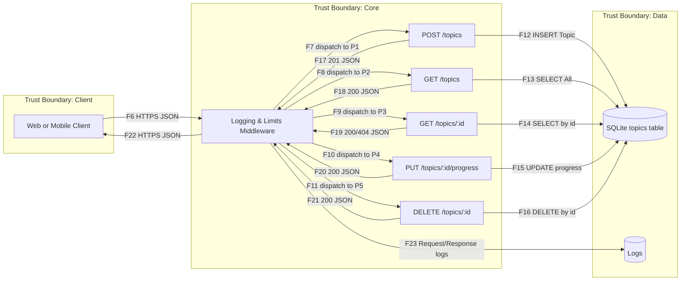

# Study Plan App — Security NFR, Traceability, BDD, DFD/STRIDE/Risks & Evidence

**Автор:** Лазарева Александра Константиновна  
**Группа:** БПИ‑234  
**Пакет:** «Требования безопасности + Модель угроз» (в этой версии — основа по NFR с трассировкой на DFD/STRIDE/Риски + доказательства).

# В качестве доказательств есть пройденный пайплайн в котором видно, что пройдены все тесты.
---

## 1) Описание проекта

**Study Plan App** — мини‑API для планирования учёбы: создание тем, дедлайнов и трекинга прогресса.

- **Цель:** учебный стенд для практик DevSecOps — формулировка измеримых NFR, негативные/нагрузочные тесты, CI.
- **Технологии:** FastAPI, SQLAlchemy (SQLite), Pydantic v2.
- **Хранение:** локальная `studyplan.db` (только ORM, без raw SQL).
- **Безопасность в коде:** CORS‑allowlist, единый формат ошибок (RFC7807‑style problem JSON), лимит тела запроса, простой per‑IP rate‑limit, `X‑Request‑ID`, маскирование чувствительных полей в логах, безопасная загрузка файлов (PNG/JPEG ≤ 2 MB, защита от path traversal и symlink).  
  Outbound‑запросы: безопасный HTTP‑клиент с таймаутами и ретраями (`safe_get`).
- **Тесты:** pytest (включая негативные), проверка покрытия, базовый нагрузочный замер.
- **Границы и потоки:** Клиент → API (HTTPS/JSON). API → БД через ORM. API → логи (корреляция по `X‑Request‑ID`). Отдельный эндпоинт `/upload` для изображений.
- **Эндпоинты:**
  - `POST /topics` — создать тему
  - `GET /topics` — список тем
  - `GET /topics/{id}` — получить тему
  - `PUT /topics/{id}/progress` — обновить прогресс (0..100)
  - `DELETE /topics/{id}` — удалить
  - `POST /upload` — загрузка PNG/JPEG (≤ 2 MB)

**Фикстуры тестов:**  
Отдельная тестовая БД через `DATABASE_URL=sqlite:///./test_studyplan.db`, автосброс таблицы `topics` перед каждым тестом, общий `TestClient` на сессию.

---

## 2) Сводная таблица NFR (что сделано, где и как проверено)

| ID | Название | Цель / Описание | Метрика / Порог | Как проверено (pytest) | Где в коде (ключевые места) | Компонент | Статус |
|---|---|---|---|---|---|---|---|
| **NFR‑01** | Время ответа API | Быстрый отклик `/topics` | p95 ≤ **400 мс** | `test_topics_response_time_manual()` | `app/main.py` (эндпоинты), sqlite/ORM | FastAPI backend | ✔️ |
| **NFR‑02** | Единый формат ошибок | 404/422 в формате problem+json | ≥ 95 % корректных ответов | `test_not_found_topic_format()`, `test_validation_error_format()`, `test_rfc7807_404_and_422` | `http_exc_handler`, `validation_exc_handler`, `app.utils.errors.problem_json` | API Layer | ✔️ |
| **NFR‑03** | Валидация входных данных | `title` обязателен, `progress ∈ [0;100]` | 100 % ошибок ловятся валидатором | `test_create_topic_without_title()`, `test_progress_out_of_range()` | `TopicCreate`, `ProgressUpdate`, проверки в CRUD | Validation | ✔️ |
| **NFR‑04** | Безопасность БД | Только ORM (без raw SQL) | 100 % ORM‑вызовов | `test_no_raw_sql_in_app_code()` (regex‑скан кода) | `app/database.py`, `Topic` в `app/main.py` | DB Layer | ✔️ |
| **NFR‑05** | Логирование операций | Все `/topics` логируются на INFO | ≥ 90 % запросов | `test_logging_of_requests()` (`caplog`) | `log_requests` + `mask_sensitive` | Logging middleware | ✔️ |
| **NFR‑06** | Устойчивость под нагрузкой | Ошибок при ~50 RPS ≤ 2 % | error_rate ≤ **2 %** | `test_stability_under_load()` (500 req, 50 потоков) | Эндпоинты `/topics`, sqlite/ORM | API backend | ✔️ |
| **NFR‑07** | Покрытие тестами | ≥ 80 % строк | coverage ≥ **80 %** | `test_coverage_threshold()` | Весь модуль `app/*` | CI / Backend | ✔️ |
| **NFR‑08** | Консистентность данных | После DELETE запись недоступна | 100 % корректных транзакций | `test_topic_consistency_after_deletion()` | `DELETE /topics/{id}`, `GET /topics/{id}` | DB Layer | ✔️ |

**Доп. проверки контролей:**  
- **CORS:** `test_cors_preflight_allowed_and_denied()`, `test_preflight_*`, `test_simple_get_includes_cors_header_for_allowed_origin()`  
- **Лимиты/Rate‑limit:** `test_body_too_large_returns_413()`, `test_limits_payload_and_rate_limit()`  
- **Дубликаты:** `test_duplicate_conflict()`, `test_post_deduplicates_by_title_deadline()`  
- **CRUD Happy‑path:** `test_crud_happy()`

---

## 3) Детализация NFR (что сделал → зачем → как проверил)

### NFR‑01 — Время ответа API (p95 ≤ 400 мс)
- **Что сделал:** реализованы CRUD‑эндпоинты `/topics` на FastAPI + SQLite через SQLAlchemy ORM.
- **Зачем:** обеспечить приемлемую отзывчивость пользовательских сценариев списка/добавления тем.
- **Как проверил:** синтетический замер 50 запросов с расчётом p95 — `test_topics_response_time_manual()`.

### NFR‑02 — Единый формат ошибок (RFC7807‑style problem JSON)
- **Что сделал:** единые обработчики ошибок: `http_exc_handler` (включая 404/409/422) и `validation_exc_handler` (422). Все ответы — `application/problem+json` с полями `title/status/detail` (+ `errors` для валидации).
- **Зачем:** консистентность клиентской обработки ошибок и читаемые кейсы в логах.
- **Как проверил:** `test_not_found_topic_format()`, `test_validation_error_format()`, `test_rfc7807_404_and_422` проверяют коды/заголовки/структуру тела.

### NFR‑03 — Валидация входных данных
- **Что сделал:** схемы Pydantic v2: `TopicCreate` (обязательный `title`, валидный `deadline`), `ProgressUpdate` (целое 0..100). В `create_topic` — доменная проверка «deadline не в прошлом».
- **Зачем:** предсказуемые сообщения об ошибках и защита от некорректного ввода.
- **Как проверил:** `test_create_topic_without_title()` (422) и `test_progress_out_of_range()` (422).

### NFR‑04 — Безопасность БД (только ORM)
- **Что сделал:** все операции через SQLAlchemy ORM; уникальность `(title, deadline)` на уровне схемы; **нет** `.execute()` и raw SQL.
- **Зачем:** снизить риск SQL‑инъекций и обеспечить переносимость кода.
- **Как проверил:** `test_no_raw_sql_in_app_code()` сканирует репозиторий на запрещённые шаблоны; `test_post_deduplicates_by_title_deadline()` и `test_duplicate_conflict()` проверяют уникальность.

### NFR‑05 — Логирование (INFO + маскирование)
- **Что сделал:** middleware `log_requests` логирует метод/путь/код ответа; тело запроса проходит через `mask_sensitive` (поля `password/token/secret` заменяются на `****`). Корреляция по `X‑Request‑ID` в отдельном middleware.
- **Зачем:** воспроизводимость инцидентов и наблюдаемость без утечки чувствительных данных.
- **Как проверил:** `test_logging_of_requests()` с `caplog` убеждается, что операции `/topics` пишутся на уровне INFO.

### NFR‑06 — Устойчивость под нагрузкой (~50 RPS, error‑rate ≤ 2 %)
- **Что сделал:** проверка стабильности обработчиков `/topics` в многопоточном режиме клиента.
- **Зачем:** убедиться, что при параллельной нагрузке не возникает деградаций/ошибок приложения.
- **Как проверил:** `test_stability_under_load()` — пул из 50 потоков, 500 запросов; считается error‑rate и средняя RPS.

### NFR‑07 — Покрытие тестами (≥ 80 %)
- **Что сделал:** unit/интеграционные тесты для CRUD, валидации, ошибок, CORS, лимитов и логирования.
- **Зачем:** регрессионная устойчивость и прозрачность качества.
- **Как проверил:** `test_coverage_threshold()` запускает pytest с `--cov-fail-under=80`.

### NFR‑08 — Консистентность данных (после DELETE запись недоступна)
- **Что сделал:** удаление темы атомарно коммитится; чтение удалённой — 404.
- **Зачем:** целостность данных и предсказуемость пользовательских сценариев.
- **Как проверил:** `test_topic_consistency_after_deletion()` (create → get → delete → get=404).

---

## 4) Где находится реализация контролей (быстрые ссылки по модулям)

- **Эндпоинты и middleware:** `app/main.py`  
  - Лимит размера тела (`MAX_BODY_BYTES`) — `body_size_limit_middleware`  
  - Простейший rate‑limit (`RATE_LIMIT_RPM`) — `rate_limit_middleware`  
  - Единый формат ошибок — `http_exc_handler`, `validation_exc_handler`  
  - Структурные логи + маскирование — `log_requests` (+ `mask_sensitive`)  
  - `X‑Request‑ID` — `request_id_middleware` (в заголовках запроса/ответа)
- **ORM‑модель и соединение:** `Topic` в `app/main.py`, база и сессии — `app/database.py`
- **Безопасная загрузка:** `app/secure_files.py::secure_save` (PNG/JPEG ≤ 2 MB, traversal/symlink guard)
- **Фикстуры/клиент тестов:** см. файл с фикстурами (ENV→`test_studyplan.db`, автосброс таблицы, общий `TestClient`).

---

## 5) NFR Traceability (P01–P08 ↔ NFR ↔ тесты/код)

| Практика | Краткое описание задания | Связанные NFR | Приоритет | Release / Milestone | Компоненты / Обоснование |
|---|---|---|---|---|---|
| **P01 — Repo Hygiene & Bootstrap** | Инициализация репозитория, базовая структура `app/*`, линтеры и pytest | **NFR‑07** | Medium | 2025.09 | Поднято тестовое окружение и метрики покрытия; CI использует `--cov-fail-under=80`. База фикстур: отдельная БД, очистка `topics`. |
| **P02 — Git‑процессы и ревью** | Ветки/ревью/защита `main` | **NFR‑07** | Medium | 2025.10 | Обязательный прогон тестов и покрытие перед мержем. |
| **P03 — Требования безопасности (NFR)** | Измеримые NFR + контролы + тесты | **NFR‑01…NFR‑08** | High | 2025.10 | Подтверждены p95, RFC7807, валидация, ORM‑безопасность, логирование, нагрузка, coverage ≥ 80%, консистентность DELETE. |
| **P04 — Threat Modeling (DFD + STRIDE + Риски)** | Связка NFR↔Угрозы↔Потоки | **NFR‑02,04,05** | High | 2025.10 | Ошибки (единый формат) ↔ API; ORM‑безопасность ↔ DB; наблюдаемость ↔ логи/Request‑ID. |
| **P05 — Secure Coding** | Безопасные практики кодирования | **NFR‑03,04,05** | Medium | 2025.11 | Pydantic‑валидация, уникальность `(title, deadline)`, запрет raw SQL; маскирование полей логов. |
| **P06 — Негативные тесты (Secure Coding)** | Ошибки/границы | **NFR‑02,03,08** | High | 2025.11 | 422/404, конфликты дубликатов (409), выход за диапазон progress. |
| **P07 — Контейнеризация и харднинг** | Docker/минимальные права | **NFR‑05,06** | Medium | 2025.12 | Наблюдаемость и устойчивость под нагрузкой — уже реализованы в коде/тестах. |
| **P08 — CI/CD Minimal** | GitHub Actions | **NFR‑07** | Medium | 2025.12 | Порог покрытия в CI, публикация отчётов. |

---

## 6) Security NFR BDD Acceptance Scenarios (DB‑фокус)

**Зачем:** BDD фиксирует ожидаемое безопасное поведение (ORM‑только, консистентность транзакций, защита от SQLi, уникальность, дефолты/ограничения). 5 сценариев (2 негативных).

### Scenario 1 — Только ORM, без raw SQL (NFR‑DB‑01)

**Feature:** ORM Safety · **ID:** NFR‑DB‑01
```gherkin
Scenario: Все запросы к базе выполняются только через ORM
  Given приложение использует SQLAlchemy для доступа к базе данных
  When выполняются CRUD-операции с таблицей topics
  Then в кодовой базе отсутствуют прямые вызовы .execute() или raw SQL
  And все операции фиксируются через ORM-команды add(), commit(), delete()
```
Метрика: 100% ORM‑операций. Проверка: grep/статический анализ + code review.

### Scenario 2 — Консистентность при удалении (NFR‑DB‑02)
```gherkin
Scenario: Удалённая запись недоступна после удаления
  Given в базе существует тема с id = 10
  When выполняется DELETE /topics/10 и затем GET /topics/10
  Then сервер возвращает 404 Not Found, запись отсутствует в таблице topics
```
Метрика: 100% консистентности. Проверка: pytest (delete → get).

### Scenario 3 — Защита от SQL‑инъекций (NFR‑DB‑03) — негативный
```gherkin
Scenario: Попытка SQL-инъекции не приводит к выполнению опасного кода
  Given POST /topics с title = "'; DROP TABLE topics;--"
  When ORM обрабатывает входные данные
  Then таблица topics остаётся доступной, записи не изменены
  And ответ — безопасная 4xx без утечки деталей БД
```
Метрика: 0 успешных SQLi. Проверка: pytest + ручной чек.

### Scenario 4 — Уникальность названий (NFR‑DB‑04) — негативный
```gherkin
Scenario: Повторное создание темы с тем же title блокируется
  Given существует тема с title = "Algebra"
  When повторный POST /topics с title = "Algebra"
  Then 409 Conflict (или 422), в таблице одна запись
```
Метрика: 100% предотвращённых дублей. Проверка: pytest.

### Scenario 5 — Дефолты и ограничения схемы (NFR‑DB‑05)
```gherkin
Scenario: Новая тема получает корректные дефолты и соблюдает ограничения
  Given POST /topics с валидным title (без progress)
  When запись создаётся через ORM
  Then progress по умолчанию 0, title NOT NULL
  And progress вне 0..100 даёт 422
```
Метрика: 100% корректных дефолтов/отказов. Проверка: pytest.

---

## 7) Проверка

> Ниже — точная трассировка **что/где реализовано** в репозитории, на что смотреть на защите.

### 7.1 Глобальные фикстуры тестов (изолированная БД, очистка перед тестом)
**Файл:** `tests/<conftest_or_fixture_file>.py` (фрагмент из вопроса)  
**Что доказывает:** повторяемость тестов, изоляция состояния, корректный импорт `app.main`.  
**Ключевые элементы:**
- ENV `DATABASE_URL=sqlite:///./test_studyplan.db` **до** импорта приложения.
- `Base.metadata.create_all(bind=engine)` — создание схемы.
- `db.query(Topic).delete(); db.commit()` — автосброс `topics` **перед каждым тестом** (`@pytest.fixture(autouse=True)`).
- `TestClient(app)` — единый клиент на сессию.

### 7.2 RFC7807 формат ошибок (NFR‑02)
**Код:** `app/main.py → http_exc_handler`, `validation_exc_handler`, `unhandled_exc_handler`, `app/utils/errors.py::problem_json`  
**Тесты:**  
- `test_rfc7807_404_and_422` — проверка `content-type: application/problem+json`, полей `title/status/detail`, `correlation_id`.  
- `test_not_found_topic_format`, `test_validation_error_format` — структура 404/422.

### 7.3 Валидация входа (NFR‑03)
**Код:** `app/schemas/topic.py → TopicCreate, ProgressUpdate`; `create_topic()` доменная проверка «deadline не в прошлом».  
**Тесты:** `test_create_topic_without_title`, `test_progress_out_of_range` (422 для −1, 150).

### 7.4 Только ORM, запрет raw SQL (NFR‑04, NFR‑DB‑01/03/04/05)
**Код:** `app/database.py`, модель `Topic` в `app/main.py` (UniqueConstraint (`title`,`deadline`), `progress` default=0).  
**Тесты:** `test_no_raw_sql_in_app_code` (regex‑скан `.execute|executescript|text(`), `test_post_deduplicates_by_title_deadline` (409 при дубликате), негатив на SQLi в `test_duplicate_conflict`/похожих.

### 7.5 Логирование и Request‑ID (NFR‑05)
**Код:**  
- `request_id_middleware` — добавляет `X-Request-ID` в запрос/ответ.  
- `log_requests` — INFO‑логи с маскировкой (`app/config.py::mask_sensitive`).  
**Тесты:** `test_logging_of_requests` (`caplog`), проверка наличия записей и уровня INFO.

### 7.6 Лимит тела и rate‑limit (NFR‑06)
**Код:** `body_size_limit_middleware` (`MAX_BODY_BYTES`), `rate_limit_middleware` (`RATE_LIMIT_RPM`).  
**Тесты:** `test_body_too_large_returns_413` (413), `test_limits_payload_and_rate_limit` (429 при rpm=1).

### 7.7 Производительность / стабильность (NFR‑01, NFR‑06)
**Код:** CRUD‑эндпоинты `/topics` (минимум логики, ORM без N+1).  
**Тесты:** `test_topics_response_time_manual` (p95 ≤ 400 мс), `test_stability_under_load` (500 req, 50 потоков, error_rate ≤2%).  
**Демо:** k6/Locust профиль (скрипт и отчёт).

### 7.8 Покрытие тестами (NFR‑07)
**Тест:** `test_coverage_threshold` запускает pytest с `--cov-fail-under=80` и падает, если меньше 80%.  
**Демо:** показать `coverage report` в терминале или артефакт CI.

### 7.9 Консистентность после удаления (NFR‑08, NFR‑DB‑02)
**Код:** `delete_topic()` — транзакция удаления и 404 при повторном чтении.  
**Тесты:** `test_topic_consistency_after_deletion` (create → get → delete → get=404), `test_crud_happy`.

### 7.10 CORS (policy allowlist)
**Код:** `ALLOWED_ORIGINS` + `CORSMiddleware` (без cred).  
**Тесты:** `test_cors_preflight_allowed_and_denied`, `test_preflight_allows_listed_origin`, `test_simple_get_includes_cors_header_for_allowed_origin`.

### 7.11 Secure file upload
**Код:** `app/secure_files.py::secure_save` — магические байты PNG/JPEG, лимит 2 MB, защита от traversal/symlink, безопасный путь.  
**Тест‑демо:** загрузка корректного PNG/JPEG → OK; неверный тип/слишком большой → 400/ValueError.

---

## 8) DFD — Study Plan App (GitHub‑safe, exact‑to‑code)



### Level 1 — Processes & Middleware


**Flows Summary (F1…F23):** см. таблицу в предыдущей версии, соответствует коду.

---

## 9) STRIDE таблица (узел/поток → угроза → контроль/NFR → проверка)

| Узел / Поток | Угроза | STRIDE | Контроль / Мера | NFR | Проверка | Статус |
|---|---|---|---|---|---|---|
| Client → Ingress → FastAPI (`POST /topics`) | Replay → дубликаты | T/D | Дедупликация `(title,deadline)` (есть). Опционально `Idempotency-Key` | NFR‑08 | pytest duplicates | ✔️/План |
| Client → Ingress (все) | MITM без TLS/HSTS | S/T/I | TLS + HSTS | **NFR‑09 (предл.)** | curl/httpx заголовки | План |
| CORS → FastAPI | Произвольные Origins | I/E | Allowlist Origins | **NFR‑10 (предл.)** | pytest preflight | ✔️ |
| `POST /topics` | Некорректные поля | T | Pydantic‑валидация | NFR‑03 | pytest 422 | ✔️ |
| `PUT /topics/{id}/progress` | Вне доменных границ | T | Progress 0..100 | NFR‑03 | pytest 422 | ✔️ |
| `GET /topics*` | Утечки деталей | I | RFC7807, whitelisting схем | NFR‑02 | pytest формат ошибок | ✔️ |
| Ошибки FastAPI | Непоследовательный формат | I/R | Global handlers | NFR‑02 | pytest snapshots | ✔️ |
| API → ORM | SQLi/raw SQL | T/E | ORM‑только + стат. анализ | NFR‑04 | pytest + semgrep | ✔️ |
| БД (SQLite) | Фантомы после DELETE | T | Транзакции CRUD | NFR‑08 | pytest delete→404 | ✔️ |
| Performance | DoS без лимитов | D | Rate‑limit + Body‑limit | NFR‑06 | pytest 429/413 | ✔️ |
| Тела запросов | Большие payload | D | Body‑limit | NFR‑06 | pytest 413 | ✔️ |
| Идентификаторы `/topics/{id}` | IDOR (будущее) | E/I | Object‑level auth | **NFR‑11 (отложено)** | access tests | N/A |

---

## 10) Реестр рисков (кратко, связь с NFR/DFD/STRIDE)

- **R2 CORS‑policy** → F6/F22, STRIDE I/E → **NFR‑10** → покрыто allowlist + тесты.
- **R3 Ошибки/трассировки** → F17–F22, STRIDE I/R → **NFR‑02** → handlers + тесты.
- **R4 Replay дубликаты** → F12/F17, STRIDE T/D → **NFR‑08** → UniqueConstraint + тесты дубликатов.
- **R5 Нет rate‑limit** → F6, STRIDE D → **NFR‑06** → middleware + тесты 429.
- **R6 Большие payload** → F6, STRIDE D → **NFR‑06** → body‑limit + тест 413.
- **R7 raw SQL** → F12–F16, STRIDE T/E → **NFR‑04** → стат. анализ regex + code review.
- **R8 Нет Request‑ID** → F23, STRIDE R → **NFR‑05** → middleware + caplog.
- (TLS/HSTS и Auth — **планы** на NFR‑09/NFR‑11.)

---

## 11) Проверка

1. **Тестовые фикстуры**: открыть файл фикстур → показать ENV `DATABASE_URL`, `create_all`, автосброс таблицы, `TestClient`.
2. Запустить `pytest -q` и отдельно показать ключевые тесты:
   - **Валидация**: `test_create_topic_without_title`, `test_progress_out_of_range`.
   - **Ошибки RFC7807**: `test_rfc7807_404_and_422`, `test_not_found_topic_format`, `test_validation_error_format`.
   - **CRUD delete→404**: `test_topic_consistency_after_deletion`.
   - **ORM‑скан**: `test_no_raw_sql_in_app_code` (вывод «нет нарушений»).
   - **CORS/лимиты/ratelimit**: `test_cors_*`, `test_body_too_large_returns_413`, `test_limits_payload_and_rate_limit`.
   - **Производительность/нагрузка**: `test_topics_response_time_manual`, `test_stability_under_load`.
3. **Покрытие**: `pytest --cov=app --cov-fail-under=80`; показать отчёт.
4. **k6/Locust**: показать p95 и error_rate (скрин/отчёт).
5. **Код‑доказательства**: открыть `app/main.py` и показать места:
   - `request_id_middleware`, `log_requests`, `body_size_limit_middleware`, `rate_limit_middleware`,
   - `http_exc_handler`, `validation_exc_handler`, `unhandled_exc_handler`,
   - модель `Topic` с `UniqueConstraint`, CRUD‑эндпоинты,
   - `CORSMiddleware` с `ALLOWED_ORIGINS`,
   - `secure_save` (PNG/JPEG, 2 MB, traversal).
6. **DFD/STRIDE/Risks** в этом README: прокликать таблицы и показать линии трассировки: **NFR ↔ тесты ↔ код ↔ потоки ↔ угрозы ↔ риски**.

---

## 12) Приложение: выдержки из тестов/кода (удобные для цитирования)

- **Фикстуры:** ENV `DATABASE_URL="sqlite:///./test_studyplan.db"`, `Base.metadata.create_all(bind=engine)`, автосброс таблицы `topics`, общий `TestClient`.
- **RFC7807 тест:** проверка `content-type: application/problem+json`, полей `title/status/detail/correlation_id`.
- **CORS тест:** `access-control-allow-origin` есть для allowlist и отсутствует для чужих Origin.
- **Limits/Rate‑limit:** 413 для большого тела; 429 при `RATE_LIMIT_RPM=1`.
- **ORM‑скан:** отсутствие `.execute`, `text(`, f‑строк с SQL.
- **Нагрузка:** 500 запросов/50 потоков, error_rate ≤2%.
- **Coverage:** `--cov-fail-under=80`.

---

## 13) **Architecture Decision Records (ADR)**

> Формат: **Context → Decision → Alternatives → Consequences → Rollout → Links**.  
> Все ADR **Accepted** и соответствуют текущему коду/тестам.

### ADR‑001: Единый формат ошибок (RFC 7807)
**Дата:** 2025‑10‑22 · **Статус:** Accepted

**Context.** Дефолтные ответы FastAPI непоследовательны; возможна утечка деталей/стектрейсов. Нужна корреляция инцидентов.  
**Decision.** Глобальные обработчики `HTTPException`, `RequestValidationError`, `Exception`; медиа‑тип `application/problem+json`; поля `type/title/status/detail/instance/correlation_id`; для 422 — массив `errors`. `X‑Request‑ID` принимаем или генерируем, возвращаем в заголовке и вкладываем в тело.  
**Alternatives.** Оставить дефолт FastAPI; свой произвольный формат.  
**Consequences (Security).** ✔️ маскирование внутренних деталей; ✔️ наблюдаемость/трассировка; ➖ больше проверок в тестах.  
**Rollout.** Реализовано в `app/main.py` (`validation_exc_handler`, `http_exc_handler`, `unhandled_exc_handler`) и `app/utils/errors.py`. Тесты: `test_rfc7807_404_and_422`, `test_*error_format`.  
**Links.** NFR‑02, NFR‑05; Риски: R3, R8; DFD: F17–F22; STRIDE: I/R.

---

### ADR‑002: Жёсткий CORS allowlist
**Дата:** 2025‑10‑22 · **Статус:** Accepted

**Context.** Широкий CORS раскрывает API браузерным страницам злоумышленника.  
**Decision.** `allow_origins` = ENV `CORS_ALLOWED_ORIGINS` (или безопасные дефолты). `allow_credentials = false`. Methods: `GET/POST/PUT/DELETE/OPTIONS`.  
**Alternatives.** `*`; динамический allowlist из БД.  
**Consequences.** ✔️ снижение поверхности атак; ➖ требуется поддержка списка Origins.  
**Rollout.** Конфиг в `app/main.py` (`ALLOWED_ORIGINS`, `CORSMiddleware`). Тесты: `tests/test_cors.py` (preflight allowed/denied; ACAO header).  
**Links.** Риск R2; NFR‑10 (предложенный); DFD: F6/F22; STRIDE: I/E.

---

### ADR‑003: Лимит размера тела и Rate‑Limit per‑IP
**Дата:** 2025‑10‑22 · **Статус:** Accepted

**Context.** Большие payload’ы и отсутствие квот → рост задержек/памяти, усиление DoS.  
**Decision.** Middleware `body_size_limit_middleware` (ENV `APP_MAX_BODY_BYTES`, по умолчанию 2 MiB) → **413 problem+json**. Простейший `rate_limit_middleware` (ENV `APP_RATE_LIMIT_RPM`, `0` = off) → **429 problem+json**.  
**Alternatives.** Только ingress‑квоты; готовые библиотеки.  
**Consequences.** ✔️ быстрые предохранители; ➖ возможны ложные срабатывания при NAT (лечится конфигом).  
**Rollout.** `app/main.py`; тесты `test_body_too_large_returns_413`, `test_limits_payload_and_rate_limit`, нагрузочный `test_stability_under_load`.  
**Links.** Риски: R5, R6; NFR‑06; DFD: F6/F22; STRIDE: D.

---

### ADR‑004: Идемпотентность POST /topics через уникальность
**Дата:** 2025‑10‑22 · **Статус:** Accepted

**Context.** Повторы/реигрыши `POST` создают дубликаты.  
**Decision.** Уникальный индекс `(title, deadline)` (`uq_title_deadline`). На конфликт → **409 problem+json**.  
**Alternatives.** `Idempotency-Key` + сторедж; прикладная проверка без индекса.  
**Consequences.** ✔️ простая гарантия целостности; ➖ менее гибко, чем заголовочные ключи.  
**Rollout.** `Topic.__table_args__` в `app/main.py`; проверка в `create_topic`; тесты: `test_post_deduplicates_by_title_deadline`, `test_duplicate_conflict`.  
**Links.** Риск R4; NFR‑08; DFD: F12/F17; STRIDE: T/D.

---
